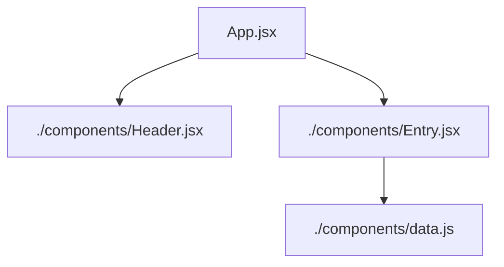

# Travel Journal Card Display

A responsive travel journal card display built with React and vanilla CSS. Features interactive location cards with a draggable image feature for better viewing on smaller screens.

## 🚀 Features

- Modern card-based UI design
- Fully responsive layout for all screen sizes
- Draggable/pannable images on smaller screens
- Component-based architecture
- Reusable custom React hook for drag functionality
- Clean vanilla CSS styling

## 🔗 Live Demo

 - Live vercel demo: [View Live Project](https://react-practice-project-travel-journ.vercel.app/)

## 🛠️ Tech Stacks

- React.js
- Vanilla CSS
- JavaScript ES6+

## 🎯 Key Learnings

### React Fundamentals
- JSX syntax and component structure
- Props for passing data between components
- State management with `useState`
- Mapping over arrays to render lists
- Event handling (mouse and touch events)

### CSS Skills
- Flexbox for flexible layouts
- CSS Grid for responsive structures
- Responsive design with media queries
- Transitions and animations
- Mobile-first approach

## Error or debug problem faced

#### problem statement
- Faced a deployment error 404
- Local images were not getting displayed in my vercel deployed website
- images were in my local ./images folder.

#### fixing it
1. I was not importing my images like shown below, instead I was directly using them in path. 

    ```js
    <!-- right approach -->
    import Globe from './../images/globe.png';
    
    
    <!-- wrong approach-->
    
    ```
2. Otherwise you might move all your images or entire './images' folder to public if you are writing like this
    ```js
    
    <!-- or -->
    
    <!-- or -->
    
    ```
3. Only these fixes solved my problem—no need to add any `vercel.json` file for now. This file is only needed for the following cases:

   - For custom URL rewrites or redirects (e.g., SPA fallback, vanity URLs).  
   - To set custom HTTP headers (e.g., security, caching).  
   - To proxy API requests to external servers.  
   - To specify a custom build or output directory.  
   - To configure internationalization (i18n) and locale routing.  
   - To set up custom environment-specific settings or function regions.  
   - To define cache-control and advanced static file handling.

## 📁 React-tree Structure



## How It Works

#### Component Reusability
- Each location card is a reusable component which is called Entry.jsx.
- We take data by mapping over data.js and pass it as a prop to Entry.jsx. 
- Entry.jsx is being imported to App.jsx to make it display on the page. 

## 👤 Author

**[Abinash Dash]**

- GitHub: [@AbiDev2003](https://github.com/AbiDev2003)

---

⭐ Connect with me. Let's grow together !